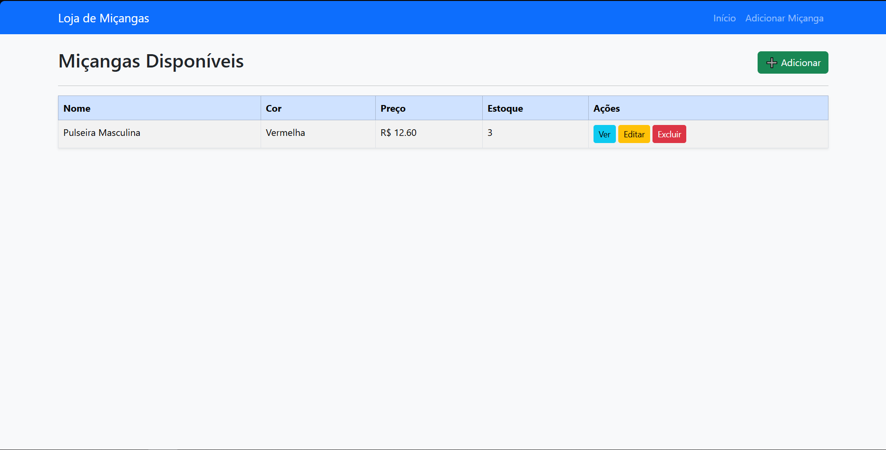
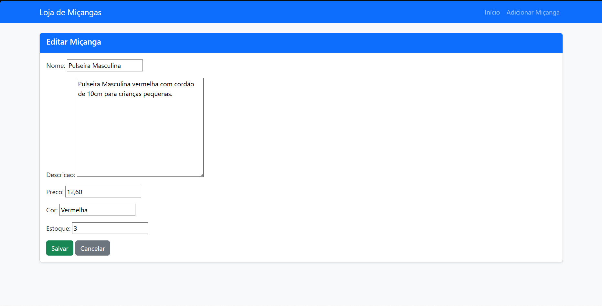
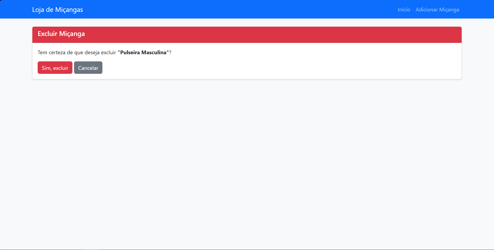

# Loja de Miçangas Online – Documentação do Projeto

## Descrição

Projeto simples e rápido apenas para entender como funciona **Class-Based Views (CBVs)**. 

### Clonar o repositório
```bash
git clone https://github.com/seu-usuario/loja-micangas.git
cd loja-micangas
```

### Criar e ativar o ambiente virtual
```bash
python -m venv venv
venv\Scripts\activate        # Windows
source venv/bin/activate     # Linux/Mac
```

### Instalar as dependências
```bash
pip install -r requirements.txt
```

### Aplicar as migrações
```bash
python manage.py makemigrations
python manage.py migrate
```

### 5️⃣ Executar o servidor
```bash
python manage.py runserver
```

A aplicação estará disponível em: **http://127.0.0.1:8000/**

## Estrutura

```
projeto_micangas/
├── manage.py
├── main/
│   ├── settings.py
│   ├── urls.py
├── projeto_micangas/
│   ├── models.py
│   ├── views.py
│   ├── urls.py
│   ├── templates/loja/
│   │   ├── listar.html
│   │   ├── detalhe.html
│   │   ├── form.html
│   │   ├── confirm_delete.html
├── templates/base.html
├── static/
├── requirement.txt
└── README.md

```

## CBV (Class-Based Views)

| Funcionalidade        | Descrição                                       | Tipo de View     |
|-----------------------|--------------------------------------------------|------------------|
| Listagem de produtos  | Exibe todas as miçangas cadastradas             | ListView         |
| Visualização detalhada| Detalhes individuais de cada produto            | DetailView       |
| Cadastro              | Inclusão de nova miçanga                        | CreateView       |
| Edição                | Alteração de dados de uma miçanga existente     | UpdateView       |
| Exclusão              | Remoção com confirmação                         | DeleteView       |


### Páginas:
## Listar produtos:
```html

```
## Detalhe dos produtos:
```html

```
## Formulário de Criação e Edição dos produtos:
```html

```
## Confirmar remoção do produto:
```html

```
